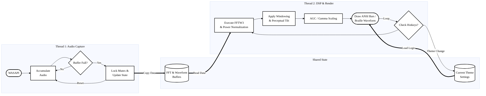

<div align="center">

  
  
  **A real-time, optimized C++ audio visualizer for the Windows console.**
  
  <!-- Badges -->
  <a href="https://github.com/majockbim/spectrum/stargazers">
    
  </a>
  
  
  
  <a href="https://github.com/majockbim/spectrum/blob/main/LICENSE">
    
  </a>

  <br>
  <br>

  


</div>

## Overview
**Spectrum** is a high-performance terminal audio visualizer built with minimalism and accuracy in mind. It captures system audio via WASAPI, processes it using the industry-standard FFTW3 library, and renders a fluid, high-contrast spectrum directly in your Windows console.

### Key Features
*   **Minimalist UI:** Focus on the music with a clean, zero-clutter interface.
*   **Professional DSP:** Featuring Hann windowing and perceptual frequency weighting for superior accuracy.
*   **Dynamic Themes:** Seamlessly switch between built-in and custom JSON themes using runtime hotkeys.
*   **Oscilloscope Mode:** Toggle a real-time Braille-based waveform view with a single keypress.
*   **Automatic Gain Control (AGC):** Rolling normalization ensures the bars always fill the screen nicely regardless of volume.
*   **High Performance:** ~0% CPU usage on modern machines with a tiny 0.4 MB memory footprint.

## System Architecture


## The DSP Engine
At the core of the visualizer is the **Discrete Fourier Transform (DFT)**, powered by the [FFTW3 C-API](https://www.fftw.org/). 

To achieve a "Winamp-level" of responsiveness and accuracy, we apply:
1. **Hann Windowing:** Eliminates spectral leakage for sharp, clean frequency bins.
2. **Instant Attack / Linear Decay:** Bars rise instantly to peaks and fall with realistic, snappy physics.
3. **Perceptual Weighting:** High frequencies are boosted to match the human ear's sensitivity (Equal-loudness curves).
4. **Gamma Contrast:** Non-linear scaling crushes background noise while making main transients "pop."

## Quick Start
1. Download the latest release from the [Releases Page](https://github.com/majockbim/spectrum/releases).
2. Extract the ZIP and run `spectrum.exe`.
3. **Controls:**
    *   **1 - 9:** Switch Themes (1: Pink, 2: Gradient, 3+: Custom).
    *   **M:** Toggle Oscilloscope Mode.

## Custom Themes
Spectrum supports fully customizable JSON themes. You can change colors, visualizer modes, and even the characters used to draw the bars.
Check out the **[THEMES.md](THEMES.md)** guide for instructions on creating your own!

## Project Structure
```text
spectrum/
├── inc/                    # Header files
│   ├── audio/              # WASAPI Engine
│   ├── math/               # FFT logic
│   ├── processing/         # Audio signal processing
│   ├── settings/           # JSON/Theme management
│   └── ui/                 # Console rendering
├── src/                    # Source files
├── themes/                 # Example custom themes
├── resources/              # App icons and metadata
├── third_party/            # FFTW3 and yyjson libraries
├── THEMES.md               # Theme creation guide
└── CONTRIBUTING.md         # Build and dev instructions
```

## Contributing & Building
If you'd like to build from source or contribute to the project, please see **[CONTRIBUTING.md](CONTRIBUTING.md)**.

## Inspiration & Honorable Mentions
**[Winamp](https://en.wikipedia.org/wiki/Winamp)**: An honorable mention to the classic **Winamp** spectral visualizer, which served as  inspiration for the responsiveness, physics, and aesthetic of this project. 

## References
[FFTW (org)](https://www.fftw.org/) | [yyjson (GitHub)](https://github.com/ibireme/yyjson) | [WASAPI Documentation](https://learn.microsoft.com/en-us/windows/win32/api/audioclient/)

## Contributors
A massive thank you to everyone who has helped build and optimize spectrum. <br>
Check out [Contributors Hall of Fame](CONTRIBUTORS.md).
