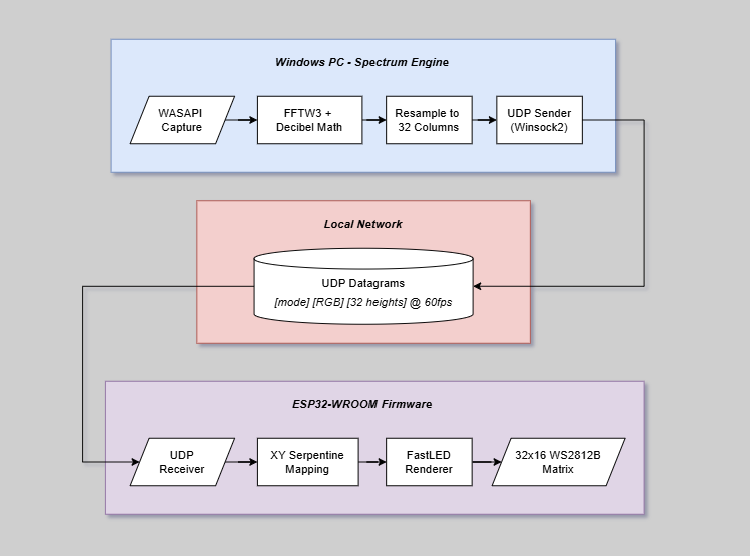

<div align="center">

  
  
  **A hardware implementation of the real-time Windows console spectrum visualizer, now running on an ESP32 with a 32×16 WS2812B LED matrix.**
  
  <!-- Badges -->


  <br>

  


</div>

---

## Overview

This project takes **[spectrum](https://github.com/majockbim/spectrum)** — a real-time C++ audio visualizer for the Windows console — and gives it a body, lifting the spectrum data off the screen and onto a **512-LED physical display** built from two chained WS2812B panels. Play music on your PC and the LED matrix pulses along in real time, frequency by frequency, mirroring the terminal exactly!

🎬 **[Watch the video demo](assets/led_spectrum_demo.mp4)**

---

## Project Structure

```text
spectrum/
├── assets/                     # + system diagram + demo video            ★ modified
├── esp32/
│   ├── spectrum_esp32.ino      # UDP receiver + XY mapping + renderers    ★ new
│   └── panel_test.ino          # hardware verification                    ★ new
├── hardware/
│   ├── images/                 # wiring + cable reference photos          ★ new
│   └── POWER.md                # power architecture + BOM                 ★ new
├── inc/
│   ├── audio/                  # AudioEngine class                        [upstream]
│   ├── math/                   # FFTEngine class                          [upstream]
│   ├── processing/             # SignalProcessor class                    [upstream]
│   ├── settings/               # JSON / theme management                  [upstream]
│   ├── ui/                     # RenderEqualizer class                    [upstream]
│   ├── network/
│   │   └── udp_sender.hpp      # UdpSender class + IP/port/column config  ★ new
│   └── main.hpp                                                           [upstream]
├── src/
│   ├── tests/
│   │   └── udp_sniffer.py      # standalone Python UDP frame inspector    ★ new
│   ├── engine.cpp              # WASAPI capture                           [upstream]
│   ├── fft.cpp                 # FFTW3 transform                          [upstream]
│   ├── main.cpp                # entry point / thread setup               [upstream]
│   ├── settings.cpp            # JSON / theme management                  [upstream]
│   ├── signal_processor.cpp    # windowing + rolling buffer               [upstream]
│   ├── udp_sender.cpp          # Winsock2 UDP sender                      ★ new
│   └── visualizer.cpp          # + resample tap + UdpSender::Send()       ★ modified
├── themes/                     # example custom themes                    [upstream]
├── third_party/                # FFTW3 + yyjson                           [upstream]
├── CMakeLists.txt              # + udp_sender.cpp + winmm + ws2_32        ★ modified
└── README.md
```

---

## System Architecture

<div align="center">
  
</div>

---

## Communication Protocol

PC → ESP32 communication uses **UDP over the local network**

### Wire Format

```text
  byte:    0      1      2      3      4      5      6            35
         ┌──────┬──────┬──────┬──────┬──────┬──────┬──────┬ ··· ┬──────┐
         │ mode │  R   │  G   │  B   │  h0  │  h1  │  h2  │     │ h31  │
         └──────┴──────┴──────┴──────┴──────┴──────┴──────┴ ··· ┴──────┘
         └ 1B ┘ └─ 3B: theme colour ─┘ └───── 32B: column heights ─────┘
          mode    R,  G,  B  (0-255)           h0 .. h31  (0-255)
```

`mode` selects the renderer: `0` = filled bars, `1` = oscilloscope trace. 
Each height byte is a column's intensity: in bar mode, `0` → dark and `255` → all 16 rows lit; in trace mode it's a vertical position, `0` → bottom edge, `255` → top edge, `128` → center. 

---

## Hardware

Two WESIRI WS2812B panels (8×32, 256 LEDs each) are chained into a single **32 column × 16 row** grid — **512 LEDs**. Panel 1 is mounted rotated 180° above Panel 0, so the data chain runs continuously across the seam:

```
             32 columns (x: 0 → 31, left → right)
       ┌────────────────────────┐  y = 0
       │ Panel 1 (2nd in chain) │  TOP half, mounted rotated 180°
       └────────────────────────┘  
          ▲  Panel 0 DOUT → Panel 1 DIN
       ┌────────────────────────┐  
       │ Panel 0 (1st in chain) │  BOTTOM half
       └────────────────────────┘  y = 15
          ▲  GPIO 32 (data pin) → Panel 0 DIN
```

> Power architecture, wiring, and full bill of materials: **[hardware/POWER.md](hardware/POWER.md)**

---

# Setup Guide

Getting from a fresh clone to a working LED display. The PC app and the ESP32 firmware are set up separately, then pointed at each other.

## Prerequisites

**PC side (Windows):**
- MSYS2 with the MinGW-w64 UCRT64 toolchain (`gcc`, `cmake`)

**ESP32 side:**
- Arduino IDE 2.x
- The **ESP32 boards package** (Espressif) — provides `WiFi.h` / `WiFiUdp.h`
- The **FastLED** library (Arduino Library Manager → search "FastLED")

## Step 1 — Wire the hardware

1. ESP32 **GPIO 32** → Panel 0 `DIN`.
2. Panel 0 `DOUT` → Panel 1 `DIN`.
3. Power bank port 1 → USB pigtail → the thick-wire **power injection points** on each panel (not the JST data connectors).
4. Power bank port 2 → USB-A to USB-C cable → ESP32 USB port.
5. **Common ground:** tie both panels' `GND` and the ESP32 `GND` together.

> Full wiring detail, photos, and BOM: **[hardware/POWER.md](hardware/POWER.md)**

## Step 2 — Verify panel geometry (optional but recommended)

Flash `esp32/panel_test.ino` first. It runs a sequence of test patterns (pixel walk, row sweep, column sweep, panel ID, corner markers). Confirm a single clean line crosses the seam between the two panels without splitting. If it does, your wiring matches the `XY()` mapping and the main firmware will render correctly. Send `n` over serial to skip to the next test.

## Step 3 — Configure and flash the firmware

Open `esp32/spectrum_esp32.ino` in Arduino IDE. Set your Wi-Fi credentials near the top:

```cpp
#define WIFI_SSID   "YourNetworkName" 
#define WIFI_PASS   "YourPassword"
```

Other settings you can leave at defaults (change only if your build differs):

```cpp
#define UDP_PORT      4210   // must match ESP32_PORT on the PC side
#define DATA_PIN      32     // GPIO the LED data line is on
#define BRIGHTNESS    25     // keep low on USB power
#define MAX_MILLIAMPS 2000   // FastLED power cap; stay inside the supply's rating
```

Select board **ESP32 Dev Module**, choose the COM port, and click **Upload**.

## Step 4 — Find the ESP32's IP address

1. Open the **Serial Monitor**: the magnifying-glass icon (top-right), or **Tools → Serial Monitor**, or **Ctrl+Shift+M**.
2. Set the baud dropdown to **115200**.
3. Press the **EN/RST** button on the ESP32 (or replug USB) so you catch the boot messages.
4. Look for the line:
   ```
   [spectrum] Connected. IP: 192.168.1.123
   ```
   Note that address — you'll need it in the next step.

If it hangs on `Connecting to WiFi ...` then reports failure, your SSID/password is wrong or the network is 5 GHz (use a 2.4 GHz network).

## Step 5 — Point the PC app at that IP

Open `inc/network/udp_sender.hpp` and set `ESP32_IP` to the address from Step 4:

```cpp
static constexpr const char* ESP32_IP   = "192.168.1.123"; // from the serial monitor
static constexpr uint16_t    ESP32_PORT = 4210;            // must match UDP_PORT in firmware
static constexpr int         N_LED_COLS = 32;              // display width
```

## Step 6 — Build and run the PC app

From the repo root:

```bash
cmake -B build -G "MinGW Makefiles"
cmake --build build_mingw
./build_mingw/spectrum.exe
```

Play any audio (Spotify, YouTube — spectrum captures whatever your speakers output). The terminal fills with bars **and** the LED panel comes alive. Silence means empty bars, which can look like nothing's working — start some music to confirm.

---

## Controls

These work in the terminal and drive the LED panel simultaneously:

| Key | Action |
|---|---|
| `1` | Gradient theme |
| `2` | Pink theme |
| `3`–`9` | Custom JSON themes from the `themes/` folder |
| `M` | Toggle modes — panel switches between filled bars and a waveform trace |
| `V` | Toggle volume scaling |

---

## Credits

Built on top of **[spectrum](https://github.com/majockbim/spectrum)** by Majock Bim — the DSP engine that makes all of this possible.